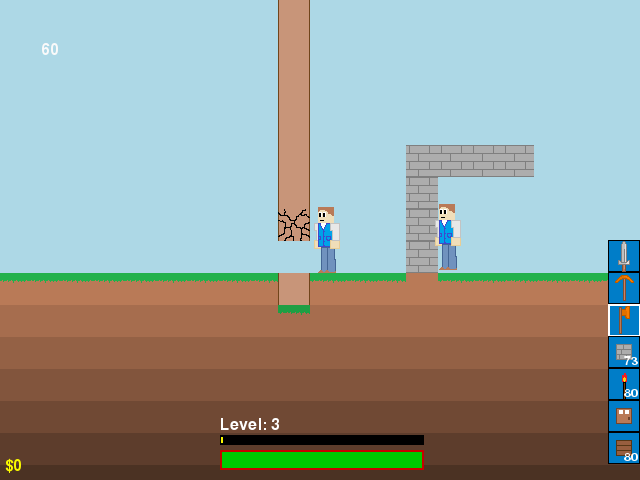

# 2DExplorer

2D exploration/building game created by Adam Benn <adambenn22@gmail.com>, the original source is available at https://github.com/adambenn/Game2. It was developd with python3 and pygame.





The game is unfinished and no longer developed, however because the core gameplay is mostly implemented, it was forked to this repository with some minor improvements.

## Installation

Download the current version from github:

```sh
# If pygame is not available from your distribution packages, install it using pip:
#    sudo python -m pip install pygame

git clone https://github.com/joaompinto/2DExplorer
```

## Play
```sh
cd 2DExplorer/Game ; python Main.py
```

## Controls
- **A and D** to move left and right, respectively
- **Space** to jump
- **Mouse Scroll** to switch items
- **Left Click** to use item
- **i** for inventory
- **ESC** to quit
